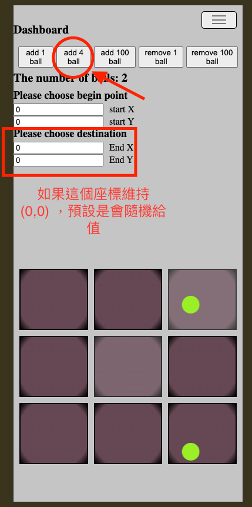

# 額外需求

## 主頁面九宮格動畫
1. 請使用兩種以上的動畫執行方式，來繪製動畫
   - 這次只用簡單的transform和opacity來實現，複雜一點也可以考慮用 [animation Web API](https://developer.mozilla.org/en-US/docs/Web/API/Animation)來實現，或是其他的套件 ex: GSAP
2. 四顆球同時朝同一個座標點移動
   - 
3. 請在效能考量下，設計可同時存在一百顆球、且指定飛行起終點的結構
   - 請點選 add 100 balls 按鈕

## 側邊選單
1. 另提供一個下拉選單，需包含所有種類。從下拉選單中選取任一項目時，等同點擊該項目
   - 下拉選單放在側邊選單裡面
2. 請實作記憶功能，關閉分頁後再開啟，可以顯示上次選取的項目
   - 資料存在localStorage，詳細可以看這 [commit](https://github.com/andy5566w/Neutec-Project/commit/7ce3d436bc05fe4a624b528f6b38d990744b11b1)
3. 請在效能考量下，設計可收合、展開最多一百層的選單
   - 利用遞歸來找到當前user點選的是哪一個選項，詳細可以看 [commit](https://github.com/andy5566w/Neutec-Project/commit/dc908ee7e5ea2f67b1d192556936f0a3399a2275)